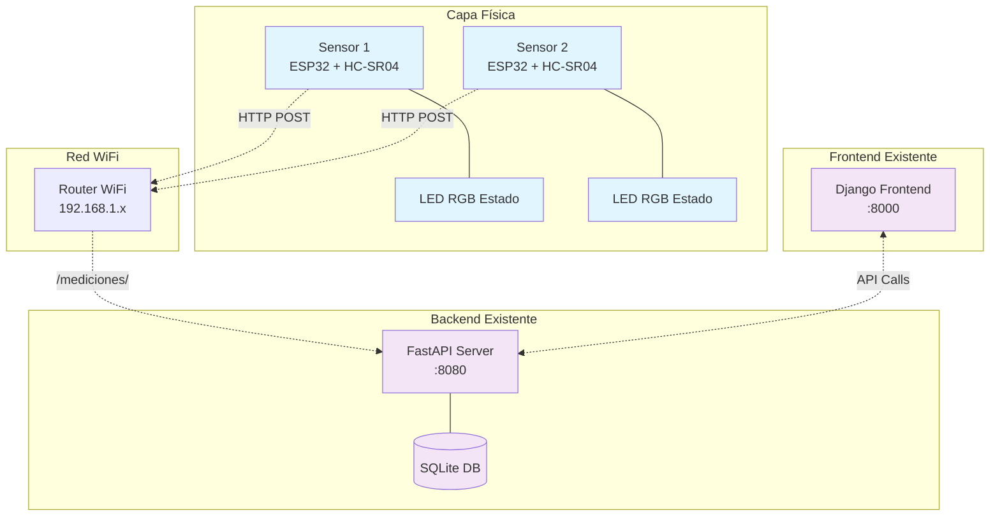
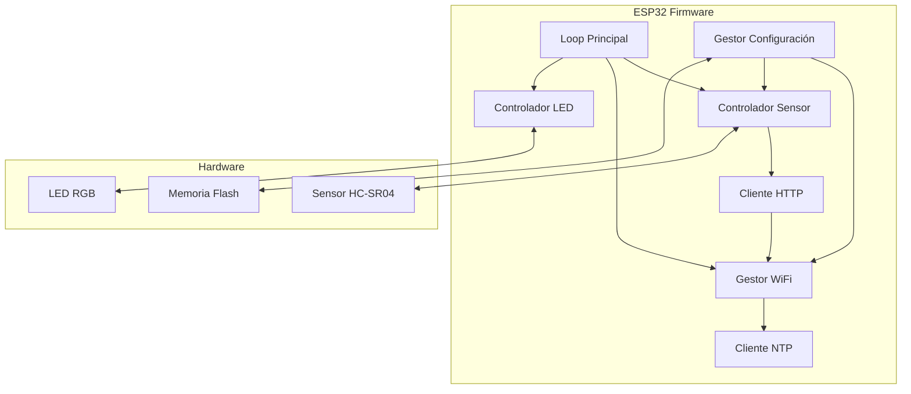

# Documento de Diseño: Integración Arduino Radar

## Visión General

El diseño de integración Arduino completa el sistema de radar de velocidad existente proporcionando la capa física de sensores. La arquitectura mantiene la separación de responsabilidades donde el backend FastAPI maneja toda la lógica de negocio y cálculos, mientras que las placas Arduino actúan como clientes HTTP simples que reportan detecciones de objetos.

La solución utiliza placas ESP32 (preferidas por WiFi integrado) o Arduino con módulos WiFi, sensores ultrasónicos HC-SR04, y LEDs RGB para indicación de estado. Cada placa funciona de forma independiente, comunicándose directamente con el backend mediante peticiones HTTP POST.

## Arquitectura

### Arquitectura General del Sistema



### Arquitectura de Software Arduino



## Componentes e Interfaces

### 1. Gestor de Conectividad WiFi

**Responsabilidades:**
- Gestión de conexión WiFi con reconexión automática
- Modo de configuración inicial (Access Point)
- Sincronización NTP para marcas de tiempo precisas

**Interfaz Principal:**
```cpp
class WiFiManager {
public:
    bool initialize();
    bool isConnected();
    void handleReconnection();
    void startConfigMode();
    bool syncNTP();
    unsigned long getTimestamp();
};
```

**Estados de Conexión:**
- `DISCONNECTED`: Sin conexión WiFi
- `CONNECTING`: Intentando conectar
- `CONNECTED`: Conectado pero sin verificar backend
- `OPERATIONAL`: Completamente operativo
- `CONFIG_MODE`: Modo configuración AP

### 2. Controlador de Sensor Ultrasónico

**Responsabilidades:**
- Lectura de distancia del sensor HC-SR04
- Filtrado de detecciones múltiples
- Validación de lecturas y manejo de errores

**Interfaz Principal:**
```cpp
class UltrasonicSensor {
private:
    int triggerPin;
    int echoPin;
    float detectionThreshold;
    unsigned long lastDetection;
    
public:
    bool initialize(int trigger, int echo);
    float readDistance();
    bool objectDetected();
    void setThreshold(float threshold);
    bool isHealthy();
};
```

**Algoritmo de Detección:**
1. Medir distancia cada 100ms
2. Si distancia < umbral y tiempo desde última detección > 2s
3. Confirmar con 3 lecturas consecutivas (filtro anti-ruido)
4. Registrar detección y activar transmisión HTTP

### 3. Cliente HTTP

**Responsabilidades:**
- Envío de peticiones POST al backend FastAPI
- Manejo de reintentos y errores de red
- Almacenamiento local temporal de mediciones

**Interfaz Principal:**
```cpp
class HTTPClient {
private:
    String serverURL;
    int maxRetries;
    std::queue<Measurement> pendingMeasurements;
    
public:
    bool sendMeasurement(unsigned long timestamp);
    void setServerURL(String url);
    bool testConnection();
    void processPendingMeasurements();
    int getPendingCount();
};
```

**Formato de Petición:**
```json
{
    "timestamp": 1640995200000,
    "sensor_id": "ESP32_001",
    "distance": 25.4
}
```

### 4. Controlador de LED de Estado

**Responsabilidades:**
- Indicación visual del estado del sistema
- Patrones de parpadeo diferenciados por estado
- Notificaciones de detección y errores

**Interfaz Principal:**
```cpp
class StatusLED {
private:
    int redPin, greenPin, bluePin;
    LEDState currentState;
    unsigned long lastUpdate;
    
public:
    void initialize(int r, int g, int b);
    void setState(LEDState state);
    void flashDetection();
    void update(); // Llamar en loop principal
};

enum LEDState {
    NO_WIFI,        // Rojo parpadeante
    NO_BACKEND,     // Amarillo parpadeante  
    OPERATIONAL,    // Verde fijo
    CRITICAL_ERROR  // Rojo/apagado alternante
};
```

### 5. Gestor de Configuración

**Responsabilidades:**
- Almacenamiento persistente de configuración
- Interfaz web para configuración remota
- Validación de parámetros

**Interfaz Principal:**
```cpp
class ConfigManager {
private:
    struct Config {
        String wifiSSID;
        String wifiPassword;
        String serverIP;
        int serverPort;
        float detectionThreshold;
        String sensorID;
    };
    
public:
    bool loadConfig();
    bool saveConfig();
    void startWebServer();
    void handleWebRequests();
    Config& getConfig();
};
```

**Página Web de Configuración:**
- Formulario HTML simple para parámetros básicos
- Endpoint REST para actualización: `GET/POST /config`
- Página de diagnóstico: `GET /status`

## Modelos de Datos

### Configuración Local (EEPROM/Flash)

```cpp
struct ArduinoConfig {
    char wifiSSID[32];
    char wifiPassword[64];
    char serverIP[16];
    int serverPort;
    float detectionThreshold;  // cm
    char sensorID[16];
    bool ntpEnabled;
    char ntpServer[32];
    int timezone;
    uint32_t checksum;
};
```

### Medición Temporal (RAM)

```cpp
struct Measurement {
    unsigned long timestamp;
    float distance;
    bool ntpSynced;
    int retryCount;
    bool transmitted;
};
```

### Estado del Sistema

```cpp
struct SystemStatus {
    WiFiState wifiState;
    bool backendReachable;
    unsigned long uptime;
    int totalDetections;
    int failedTransmissions;
    float lastDistance;
    bool sensorHealthy;
    unsigned long lastNTPSync;
};
```

## Propiedades de Corrección

*Una propiedad es una característica o comportamiento que debe mantenerse verdadero en todas las ejecuciones válidas del sistema - esencialmente, una declaración formal sobre lo que el sistema debe hacer. Las propiedades sirven como puente entre las especificaciones legibles por humanos y las garantías de corrección verificables por máquina.*

Antes de definir las propiedades, realizaré el análisis de prework para determinar qué criterios de aceptación son testables:

### Propiedades de Corrección

Basándome en el análisis de prework, las siguientes propiedades universales deben mantenerse:

**Propiedad 1: Configuración WiFi inicial**
*Para cualquier* placa Arduino sin configuración WiFi previa, al encenderse debe activar automáticamente el modo de punto de acceso con interfaz web de configuración disponible
**Valida: Requerimientos 1.1, 1.2**

**Propiedad 2: Persistencia y conexión WiFi**
*Para cualquier* conjunto de credenciales WiFi válidas introducidas, la placa debe almacenarlas en memoria no volátil y establecer conexión a la red especificada
**Valida: Requerimientos 1.3**

**Propiedad 3: Reconexión automática WiFi**
*Para cualquier* pérdida de conexión WiFi durante el funcionamiento, la placa debe intentar reconectarse cada 30 segundos, y tras 10 fallos consecutivos debe reactivar el modo de configuración
**Valida: Requerimientos 1.4, 1.5**

**Propiedad 4: Detección y filtrado de objetos**
*Para cualquier* objeto que entre en el rango de detección, el sensor debe detectarlo correctamente y filtrar detecciones múltiples del mismo objeto durante un período de 2 segundos
**Valida: Requerimientos 2.1, 2.2**

**Propiedad 5: Transmisión HTTP tras detección**
*Para cualquier* detección válida de objeto, la placa debe enviar inmediatamente una petición HTTP POST al endpoint /mediciones/ con formato JSON correcto y headers apropiados
**Valida: Requerimientos 2.3, 3.1, 3.2**

**Propiedad 6: Disponibilidad continua del sensor**
*Para cualquier* detección completada, el sensor debe estar inmediatamente listo para procesar la siguiente detección sin demora
**Valida: Requerimientos 2.4**

**Propiedad 7: Manejo de respuestas HTTP**
*Para cualquier* respuesta HTTP del backend, la placa debe manejar códigos 200 como éxito, y códigos 4xx/5xx con hasta 3 reintentos antes de registrar error local
**Valida: Requerimientos 3.3, 3.4, 3.5**

**Propiedad 8: Correspondencia estado-LED**
*Para cualquier* estado del sistema (sin WiFi, sin backend, operativo, error crítico, detección), el LED debe mostrar el patrón de color y parpadeo correspondiente definido en la especificación
**Valida: Requerimientos 4.1, 4.2, 4.3, 4.4, 4.5**

**Propiedad 9: Configuración correcta de hardware**
*Para cualquier* instalación de placa Arduino, debe usar los pines estándar definidos (sensor en pines 2-3, LED RGB en pines 9-11)
**Valida: Requerimientos 5.2, 5.3**

**Propiedad 10: Almacenamiento offline**
*Para cualquier* fallo de conexión WiFi durante funcionamiento, la placa debe continuar detectando y almacenar hasta 50 mediciones localmente, descartando las más antiguas si se llena la memoria
**Valida: Requerimientos 6.1, 6.3**

**Propiedad 11: Sincronización tras reconexión**
*Para cualquier* restablecimiento de conexión tras período offline, la placa debe enviar todas las mediciones almacenadas en orden cronológico correcto
**Valida: Requerimientos 6.2**

**Propiedad 12: Recuperación automática de sensor**
*Para cualquier* fallo o lectura inconsistente del sensor ultrasónico, la placa debe reiniciar automáticamente el sensor, y tras 3 fallos consecutivos debe activar modo de error crítico
**Valida: Requerimientos 6.4, 6.5**

**Propiedad 13: Interfaz web de configuración**
*Para cualquier* acceso HTTP a la IP de la placa, debe servir una página web de configuración con todos los parámetros ajustables disponibles
**Valida: Requerimientos 7.1**

**Propiedad 14: Aplicación inmediata de configuración**
*Para cualquier* cambio de configuración válido, la placa debe aplicar el nuevo valor inmediatamente sin requerir reinicio y persistir el cambio en memoria no volátil
**Valida: Requerimientos 7.2, 7.4**

**Propiedad 15: Validación de parámetros**
*Para cualquier* valor de configuración de sensibilidad, la placa debe validar que esté en el rango 10-400 cm antes de aplicarlo
**Valida: Requerimientos 7.3**

**Propiedad 16: Información de diagnóstico**
*Para cualquier* solicitud de diagnóstico, la placa debe proporcionar información completa incluyendo tiempo de funcionamiento, número de detecciones y estado de componentes
**Valida: Requerimientos 7.5**

**Propiedad 17: Gestión completa de NTP**
*Para cualquier* placa Arduino, debe sincronizar con servidor NTP al inicio, usar reloj interno marcando como "no sincronizado" si falla NTP, y resincronizar automáticamente cuando se restablezca la conexión
**Valida: Requerimientos 8.1, 8.3, 8.4**

**Propiedad 18: Timestamps precisos en mediciones**
*Para cualquier* detección de objeto, la petición HTTP debe incluir una marca de tiempo precisa en milisegundos
**Valida: Requerimientos 8.2**

## Manejo de Errores

### Estrategia de Recuperación por Capas

**Nivel 1 - Errores de Sensor:**
- Reinicio automático del sensor tras lecturas inconsistentes
- Validación de rango de distancia (0.1m - 4m para HC-SR04)
- Modo degradado: continuar operación con sensor secundario si disponible

**Nivel 2 - Errores de Conectividad:**
- Reconexión WiFi automática con backoff exponencial
- Almacenamiento local de hasta 50 mediciones durante desconexión
- Modo offline: continuar detección sin transmisión

**Nivel 3 - Errores de Sistema:**
- Watchdog timer para reinicio automático tras cuelgues
- Modo de configuración de emergencia tras fallos críticos
- LED de estado para diagnóstico visual

### Códigos de Error

```cpp
enum ErrorCode {
    NO_ERROR = 0,
    SENSOR_TIMEOUT = 1,
    SENSOR_OUT_OF_RANGE = 2,
    WIFI_CONNECTION_FAILED = 3,
    HTTP_REQUEST_FAILED = 4,
    NTP_SYNC_FAILED = 5,
    MEMORY_FULL = 6,
    CONFIG_INVALID = 7,
    CRITICAL_SYSTEM_ERROR = 99
};
```

### Logging Local

Almacenamiento rotativo de últimos 100 eventos en EEPROM:
- Timestamp del evento
- Código de error
- Contexto adicional (distancia medida, código HTTP, etc.)

## Estrategia de Testing

### Enfoque Dual de Testing

**Tests Unitarios:**
- Validación de funciones individuales (cálculo de distancia, formateo JSON)
- Casos específicos de error y condiciones límite
- Mocking de hardware para testing en PC

**Tests Basados en Propiedades:**
- Verificación de propiedades universales con entradas aleatorias
- Simulación de condiciones de red variables
- Testing de estados del sistema con transiciones aleatorias

### Configuración de Property-Based Testing

**Framework:** Utilizaremos la librería `ArduinoUnit` con extensiones custom para property testing
**Iteraciones mínimas:** 100 por cada test de propiedad
**Etiquetado:** Cada test referenciará su propiedad del diseño

Ejemplo de configuración:
```cpp
// Feature: integracion-arduino-radar, Property 4: Detección y filtrado de objetos
void test_detection_filtering_property() {
    for(int i = 0; i < 100; i++) {
        float distance = random(5, 400); // cm
        unsigned long interval = random(100, 5000); // ms
        
        // Test que detección válida se procesa
        // y detecciones múltiples se filtran
        assertTrue(testDetectionFiltering(distance, interval));
    }
}
```

### Tests de Integración

**Simulador de Backend:** Mock server HTTP para testing de comunicación
**Simulador de Hardware:** Abstracción de pines para testing sin hardware físico
**Tests de Red:** Simulación de fallos de conectividad y latencia variable

### Herramientas de Testing

- **PlatformIO Unit Testing:** Framework base para tests
- **ArduinoFake:** Mocking de funciones Arduino
- **WiFi Mock:** Simulación de conectividad de red
- **HTTP Mock Server:** Testing de comunicación con backend

Los tests unitarios se enfocan en ejemplos específicos y casos límite, mientras que los tests de propiedades verifican comportamientos universales con amplia cobertura de entradas. Juntos proporcionan cobertura completa: los tests unitarios detectan bugs concretos y los tests de propiedades verifican corrección general.